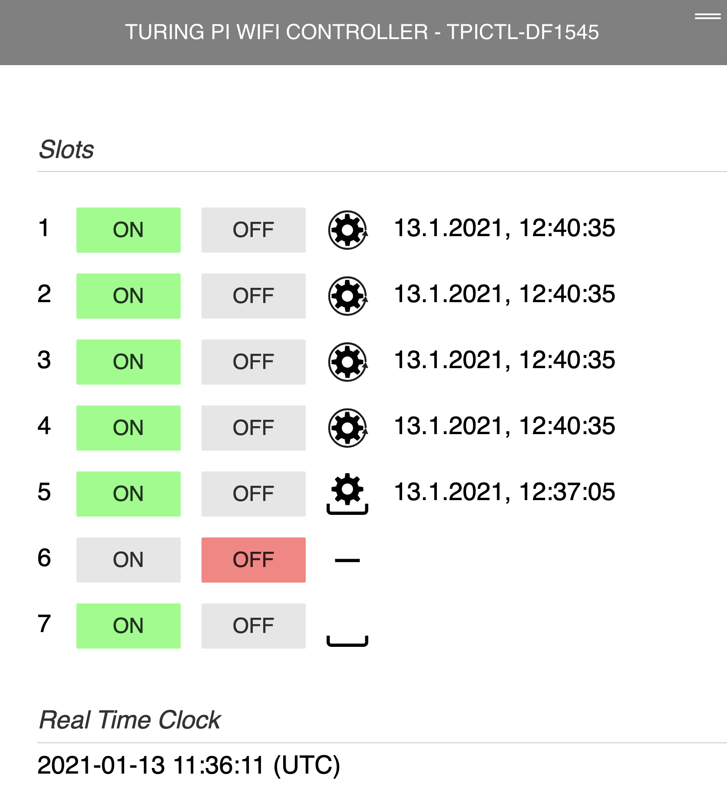

# ESP8266 Turing Pi WiFi Controller

A WiFi Controller for the [Turing Pi V1 cluster board](https://turingpi.com/) connected via the onboard I2C bus. With this contoller you are able to switch the power on or off of each individual Turing Pi slot.
It provides a Web, REST and telnet interface. MQTT is not implemented yet.

## !!! ATTENTION !!!

At this point there is no warning of turning a slot ON/OFF, just one click and the slot is ON or OFF!

## Screenshots

Find screenshots of all available web pages in the [docs](./docs/) directory.

## Precompiled Firmware

Find the precompiled firmware in the [firmware](./firmware/) directory.

## Compile

This is a [PlatformIO](https://platformio.org/) project.

### Docker as PlatformIO build environment

If you need a clean PlatformIO build environment, use the scripts in the `docker` directory.

## Default Network Settings

After a firmware reset the following values are set.

|                            | value                 | description                           |
| -------------------------- | --------------------- | ------------------------------------- |
| Admin user                 | admin                 | Setup admin user                      |
| Admin password             | admin                 | Setup admin password                  |
| WiFi Mode                  | AP                    | Accesspoint- or Station-Mode          |
| WiFi SSID                  | tpictl-`esp-id`       | SSID in accesspoint mode              |
| WiFi Password              | 12345678              | Default WiFi password                 |
| Network Mode               | DHCP                  | Network mode STATIC or DHCP \*1       |
| Network IP-Address         | 192.168.192.1         | device ip address \*2                 |
| Network Mask               | 255.255.255.0         | Subnet mask \*2                       |
| Network Gateway            | 192.168.192.1         | Default gateway \*2                   |
| Network DNS                | 192.168.192.1         | DNS server address \*2                |

\*1 In WiFi Station-Mode only

\*2 will be overwritten with DHCP-Response

## References

- [PlatformIO](https://platformio.org/)
- [Arduino core for ESP8266 WiFi chip](https://github.com/esp8266/Arduino)
- [Arduino-pubsubclient - A client library for the ESP8266 that provides support for MQTT](https://github.com/knolleary/pubsubclient)
- [Pure.CSS - A nice CSS, as GZIP it is less than 4k so it is useful for embedded devices](https://purecss.io/)
